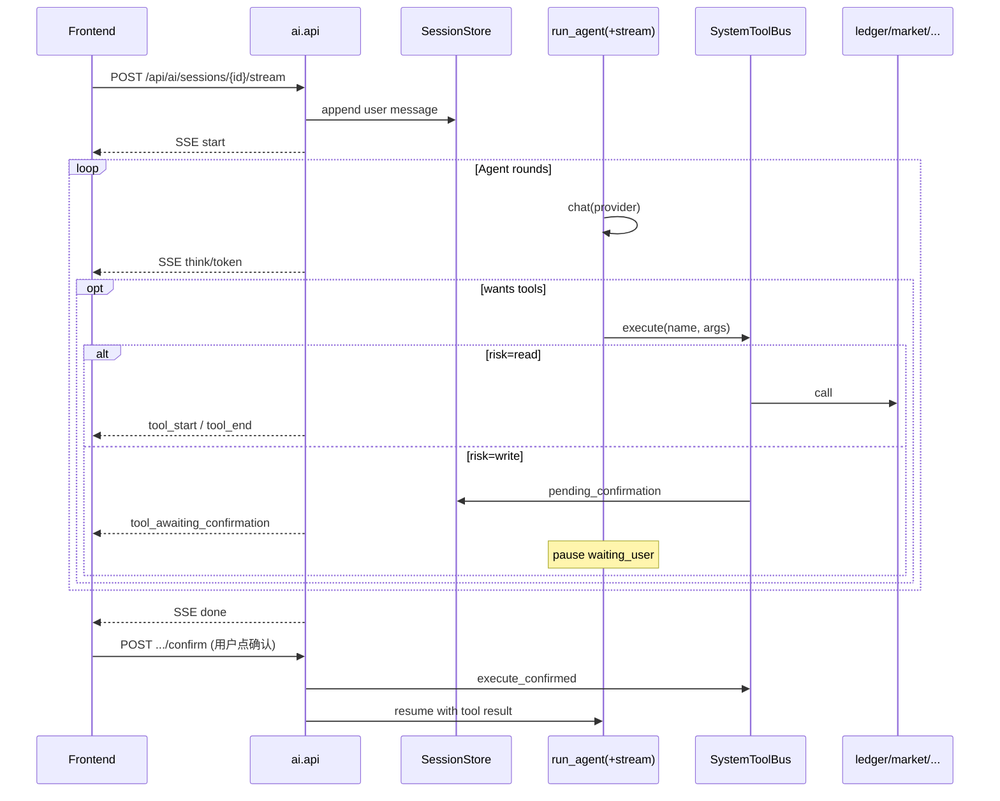

# Loci AI 对话助手 · 后端实现计划

> **状态**：设计稿（未开工）  
> **读者**：后端 / 组合根 / 测试 / 后续 Coding Agent  
> **对齐**：[`docs/master-plan-2026-07.md`](../master-plan-2026-07.md) §P4、现有 `src/ai`、参考实现 `E:\work_space\qiz-ai-gateway`（AgentLoop + SSE + HITL）  
> **配套前端**：[`ai-assistant-frontend-design.md`](./ai-assistant-frontend-design.md)

---

## 1. 目标与非目标

### 1.1 产品目标

在 Loci 工作台内提供**全局 AI 对话助手**：用户用自然语言完成配置、查行情/账本、调持仓相关记录、跑选股/回测、运维探查等，助手通过**预注册工具总线**调用系统能力，**数字一律来自工具结果**，模型只负责编排与解释。

### 1.2 成功标准

| # | 标准 |
|---|---|
| S1 | 任意已登录页可发起多轮对话；会话可持久化、可续聊、可中止 |
| S2 | 工具覆盖 ledger / market / strategy / review / ops / intel（MCP）只读面 + 受控写面 |
| S3 | 写操作**两段式确认**（提议 → 用户确认 → 落库 → 结果回灌模型） |
| S4 | SSE 流式：token / 思考 / 工具起止 / 待确认 / usage / done / error |
| S5 | 不发明行情与盈亏；无工具证据时前端可二次告警（后端 system + 事件标记） |
| S6 | 与现有 `run_agent` / `build_toolbus` / LLM 供应商体系兼容，不另起 LiteLLM |

### 1.3 非目标

- 不做自动下单 / 券商通道（硬约束）
- 不上 LangGraph / Celery / Redis；单机 SQLite + 进程内 Agent 循环
- 不把对话全文当账本权威；对话库可清理
- 不做「任意代码沙箱」；能力边界 = 工具注册表
- 不把 MCP 工具集「无限膨胀」进每轮上下文（按场景/意图收窄）

---

## 2. 现状盘点（仓库证据）

| 能力 | 现状 | 缺口 |
|---|---|---|
| LLM 供应商 | `src/ai` + `ops.db` 加密密钥、模型目录 | 已满足 P4 D3 |
| Agent 环 | `run_agent`：多轮 FC、HITL `ask_user`、`on_event` | **无 HTTP SSE 出口**；事件未标准化为协议 |
| Toolbus | `build_toolbus`：Skill CLI + MCP + 内置 | **绑在 Skill 上**；缺系统级「工作台工具面」 |
| HTTP | `/api/providers*`、`/api/ai/judgments` | **无** `/api/ai/chat*` / sessions / confirm |
| 技能 Run | ops Skill Run + 续聊 `replySkillRun` | 与全局助手会话模型未统一 |
| MCP | `src/intel` HTTP MCP、运维页管理 | 可挂入助手，需预算与白名单 |
| 持久化 | 判断写入 palace；对话无专用表 | 需 `ops.db`（或独立 `ai.db`）会话表 |

结论：**内核（chat + agent + toolbus）已在，缺「系统工具目录 + 会话持久化 + SSE 协议 + 写确认」四件套。**

---

## 3. 架构

### 3.1 限界上下文落点

```
frontend (悬浮助手)
    │  SSE / REST
    ▼
src/ai/api          ← 入站：会话 CRUD、stream、confirm、abort
src/ai/application  ← 用例：session_chat、tool_catalog、confirm_write
        │
        ├── domain          ← Session / MessagePart / ToolRisk / 领域错误
        ├── infrastructure  ← AiSessionStore（SQLite）、stream bridge
        ├── ops             ← 解析 ProviderConfig / 可选 Skill
        ├── intel           ← MCP tools（可选）
        ├── ledger/market/… ← 仅经包公开 API 实现「系统工具」
        └── shared          ← paths / 鉴权依赖
```

- **Domain**：零 FastAPI / 零 sqlite3。
- **Application**：编排 Agent + ToolBus + Store；禁止在路由写业务公式。
- **跨域**：工具处理器只调用 `from src.ledger import …` / `from src.market import …` 等包根，禁止掏 `infrastructure.*`。
- **组合根**：在 `build_ai_router`（或独立 `build_assistant_router`）挂载；写接口走既有 `write_dependency`。

### 3.2 运行时拓扑（单次用户消息）



### 3.3 与 qiz-ai-gateway 的对照（取什么 / 不取什么）

| Gateway | Loci 采纳 |
|---|---|
| `AgentLoop` while + tool callbacks | 扩展现有 `run_agent`，加流式 `on_event` 标准化 |
| SSE：`start/think/token/tool_*/error/done` | **事件名对齐**，载荷字段本仓化 |
| 会话超时预算（maxToolSteps × toolTimeout） | 同思路：`max_rounds` + 单工具 timeout + 会话硬顶 |
| Playground inspect / usage | MVP：usage；inspect 二期 |
| 断线续流协议 v3 | MVP：`AbortController` + 可选 `run_id` 重放只读事件；完整 resume 二期 |
| 独立 Java 网关 | **不做**；内嵌 FastAPI |

---

## 4. 数据模型（持久化决策）

遵循「丢了可不可以重建？丢了会不会否认账？」：

| 数据 | 入库 | 库 | 说明 |
|---|---|---|---|
| 会话元数据 / 消息 / 工具轨迹 | **必须（可清理）** | `ops.db` 表前缀 `ai_` | 非账本；提供清理 Job |
| pending 写确认 | **必须（短命）** | `ops.db` `ai_pending_actions` | TTL + 过期作废 |
| token 日用量 | **必须** | `ops.db` `ai_usage_daily` | 成本硬顶 |
| 账本事实 | **禁止经对话旁路** | `palace.db` | 仅确认后走 ledger 公开 API |
| UI 球位置 / 面板尺寸 | **不入库** | localStorage | |

> 主计划曾提 `ai.db`。为少文件少锁冲突，**MVP 落 `ops.db`**；若对话写入与 Job 调度抢锁再拆库（ADR）。

### 4.1 表设计草案

```sql
-- 会话
CREATE TABLE IF NOT EXISTS ai_sessions (
  id            TEXT PRIMARY KEY,
  title         TEXT NOT NULL DEFAULT '',
  status        TEXT NOT NULL DEFAULT 'idle',  -- idle|streaming|waiting_user|error|archived
  provider      TEXT NOT NULL DEFAULT '',
  model         TEXT NOT NULL DEFAULT '',
  system_preset TEXT NOT NULL DEFAULT 'workbench', -- workbench|readonly|skill:<slug>
  created_at    TEXT NOT NULL,
  updated_at    TEXT NOT NULL,
  last_error    TEXT NOT NULL DEFAULT '',
  meta_json     TEXT NOT NULL DEFAULT '{}'
);
CREATE INDEX IF NOT EXISTS idx_ai_sessions_updated ON ai_sessions(updated_at DESC);

-- 消息（UI 轮次；tool 中间态可嵌 parts_json）
CREATE TABLE IF NOT EXISTS ai_messages (
  id          TEXT PRIMARY KEY,
  session_id  TEXT NOT NULL REFERENCES ai_sessions(id),
  role        TEXT NOT NULL,          -- user|assistant|system
  seq         INTEGER NOT NULL,
  content     TEXT NOT NULL DEFAULT '',
  parts_json  TEXT NOT NULL DEFAULT '[]', -- text/think/tool/confirm/warning
  created_at  TEXT NOT NULL,
  UNIQUE(session_id, seq)
);
CREATE INDEX IF NOT EXISTS idx_ai_messages_session ON ai_messages(session_id, seq);

-- Agent 内部消息快照（续跑 / HITL）
CREATE TABLE IF NOT EXISTS ai_agent_snapshots (
  session_id   TEXT PRIMARY KEY REFERENCES ai_sessions(id),
  messages_json TEXT NOT NULL,  -- messages_to_json 形态
  updated_at   TEXT NOT NULL
);

-- 待确认写操作
CREATE TABLE IF NOT EXISTS ai_pending_actions (
  id           TEXT PRIMARY KEY,
  session_id   TEXT NOT NULL,
  message_id   TEXT NOT NULL,
  tool_name    TEXT NOT NULL,
  arguments_json TEXT NOT NULL,
  risk         TEXT NOT NULL,      -- write|destructive
  summary      TEXT NOT NULL,      -- 给人看的一句话
  status       TEXT NOT NULL,      -- pending|confirmed|rejected|expired
  expires_at   TEXT NOT NULL,
  result_json  TEXT NOT NULL DEFAULT '',
  created_at   TEXT NOT NULL
);
CREATE INDEX IF NOT EXISTS idx_ai_pending_session ON ai_pending_actions(session_id, status);

-- 用量
CREATE TABLE IF NOT EXISTS ai_usage_daily (
  day          TEXT NOT NULL,       -- YYYY-MM-DD
  provider     TEXT NOT NULL,
  model        TEXT NOT NULL,
  input_tokens INTEGER NOT NULL DEFAULT 0,
  output_tokens INTEGER NOT NULL DEFAULT 0,
  calls        INTEGER NOT NULL DEFAULT 0,
  PRIMARY KEY (day, provider, model)
);
```

Schema 变更 DoD：落 ops store 初始化/补丁；README 写清可清理；测试用临时 db。

---

## 5. 系统工具总线（System ToolBus）

### 5.1 设计原则

1. **注册表驱动**：`ToolSpec(name, description, args_schema, risk, handler, tags)`，禁止在 Agent 里 if-else 厂商工具。
2. **风险分级**：
   - `read`：自动执行
   - `write`：两段式确认
   - `destructive`：确认 + 二次文案（删候选/清缓存等）
3. **数字铁律**：行情/盈亏/回测数字只从工具返回；handler 返回结构化 `text` + 可选 `structured`。
4. **上下文预算**：默认启用「工作台核心集」≈ 25–40 工具；MCP 全量不进默认集，按 `mcp_servers` / 用户勾选 / 意图路由追加。
5. **复用**：Skill 场景继续用现有 `build_toolbus(skill)`；全局助手用 `build_system_toolbus(preset=...)`；两者共享 executor 协议与事件形状。

### 5.2 工具目录（MVP → 扩展）

#### A. 账本只读（read）

| name | 说明 | 背后 API |
|---|---|---|
| `ledger_dashboard` | 仪表盘摘要 | palace dashboard |
| `ledger_positions` | 当前持仓列表 | holdings |
| `ledger_trades` | 成交查询 | getTrades |
| `ledger_candidates` | 候选池查询 | listCandidates |
| `ledger_timeline` | 单票时间线 | getTimeline |
| `ledger_plans` | 预案只读 | plans |
| `ledger_reviews` | 复盘记录 | getReviews |

#### B. 账本写入（write → confirm）

| name | 说明 | 确认文案要点 |
|---|---|---|
| `ledger_propose_trade` | 记成交 | 代码/方向/价/量/日期 |
| `ledger_propose_candidate` | 写候选 | 池/判断/理由 |
| `ledger_propose_plan` | 写预案 | 区间/止损止盈 |
| `ledger_propose_review` | 写复盘 | 结论字段 |
| `ledger_propose_cashflow` | 记资金流水 | 金额方向 |
| `ledger_propose_delete_candidate` | 删候选 | destructive |

确认后调用与前端对话框**同一** application/store 路径，并打 `metadata_json.source=ai_assistant` + `pending_id` 审计。

#### C. 行情（read）

| name | 说明 |
|---|---|
| `market_quote_snapshot` | 标的最新行情/估值摘要 |
| `market_kline` | 日 K（限根数，防撑爆上下文） |
| `market_universe_search` | 代码/名称搜索 |
| `market_sync_status` | 同步水位/健康 |
| `market_index_overview` | 指数/宽度（若已有 API） |

禁止工具返回「编造」填充；失败必须 `is_error`。

#### D. 策略 / 选股（read + 受控写）

| name | risk | 说明 |
|---|---|---|
| `strategy_list` | read | 策略/技能目录 |
| `strategy_screen_run` | write* | 触发选股 Run（可长时）；*若仅启动 Job 可视作 write 或 `ops` 级确认 |
| `strategy_screen_result` | read | 拉取最近结果 |
| `strategy_backtest_run` | write* | 启动回测（Job） |
| `strategy_backtest_summary` | read | 回测摘要（权威数字来自引擎） |

长任务：工具返回 `job_id` / `run_id`，前端展示进度芯片（已有 `ScreenRunChip`），Agent 可轮询 status 工具。

#### E. 复盘（read）

| name | 说明 |
|---|---|
| `review_equity` | 资金曲线摘要 |
| `review_winrate` | 胜率口径（后端计算） |
| `review_round_trips` | 往返交易 |
| `review_candidate_outcomes` | 候选 T+N |

#### F. 运维 / 配置（read + write）

| name | risk | 说明 |
|---|---|---|
| `ops_list_providers` | read | 供应商列表（无密钥） |
| `ops_set_default_provider` | write | 切换默认模型 |
| `ops_list_jobs` | read | Job 列表 |
| `ops_trigger_job` | write | 触发 Job |
| `ops_list_mcp` | read | MCP 服务器 |
| `ops_wecom_settings_get` | read | 通知设置摘要 |
| `ops_update_notify` | write | 改通知（确认） |

密钥明文**永不**进工具参数或模型上下文。

#### G. 对话内置

| name | 说明 |
|---|---|
| `ask_user` | HITL 选择题（沿用现实现） |
| `navigate_hint` | 返回前端路由建议（不强制跳转） |
| `open_ui_action` | 建议打开某对话框（trade/record），由前端执行 |

#### H. MCP（可选）

- 名称：`{server}__{tool}`（与现有一致）
- 默认 off；会话级或全局设置启用 server 白名单
- `MAX_TOOLS` 截断策略保持；超限按标签优先级裁剪

### 5.3 ToolSpec 代码形状（示意）

```python
@dataclass(frozen=True)
class ToolSpec:
    name: str
    description: str
    args_schema: dict[str, Any]
    risk: Literal["read", "write", "destructive"]
    tags: frozenset[str]  # ledger|market|strategy|ops|mcp
    timeout_sec: int = 60
    # handler(arguments, ctx: ToolContext) -> dict[str, Any]
```

`ToolContext`：`session_id`、`user`、`confirm_token`（仅确认通道）、`on_event`、只读 store 工厂。

写工具在 **未确认** 路径只返回：

```json
{
  "text": "已准备记一笔成交，等待确认",
  "is_error": false,
  "meta": {
    "pause": true,
    "needs_hitl": true,
    "pending_action_id": "...",
    "ask": {
      "kind": "confirm_write",
      "summary": "买入 600519 100股 @ 1680.00（2026-07-31）",
      "diff": { "...": "..." }
    }
  }
}
```

---

## 6. Agent 循环增强

### 6.1 在现有 `run_agent` 上增量

保留：`max_rounds`、`max_calls_per_round`、结果截断、HITL pause、`messages` 续跑。

新增：

| 项 | 说明 |
|---|---|
| 流式 chat | `infrastructure/client` 增加 `chat_stream`（openai_compatible / anthropic），边收边 `on_event({type:"token"|"think"})` |
| 标准化事件 | 见 §7；内部仍可用 dict，API 层映射 SSE |
| 预算 | `max_rounds`、月 token 硬顶（读 `ai_usage_daily`）、单会话 wall-clock |
| 系统提示预设 | `workbench` / `readonly` / `skill`；铁律段落不可被 Skill 覆盖 |
| 反幻觉标记 | 若最终文本匹配「价格/涨跌幅/MACD…」启发式且本轮无成功 `market_*`/`review_*` 工具 → `done.flags.needs_evidence_warning=true` |

### 6.2 系统提示铁律（摘要）

1. 不得编造行情、持仓盈亏、回测指标；没有工具结果就说「未取到数据」。
2. 写账本只能调用 `ledger_propose_*`，不得声称「已写入」直到确认事件返回成功。
3. 不做自动交易指令；不引导「一键跟单」。
4. 优先用工具；需要用户选择时用 `ask_user`。
5. 回答用中文、简洁、可操作；附「建议打开的页面」时用 `navigate_hint`。

### 6.3 状态机

```
idle
  --user message--> streaming
streaming
  --tool read--> streaming
  --tool write propose--> waiting_user
  --ask_user--> waiting_user
  --llm done--> idle
  --error--> error
  --abort--> idle
waiting_user
  --confirm / reject / reply--> streaming
  --expire--> idle (pending expired)
error
  --user message--> streaming
```

`ai_sessions.status` 与上述对齐。

---

## 7. HTTP API

所有写操作：`write_dependency`。流式：`POST` + `Accept: text/event-stream`（或固定 stream 路径）。

### 7.1 会话

| 方法 | 路径 | 说明 |
|---|---|---|
| GET | `/api/ai/sessions` | 列表：`?limit&cursor&q`；返回 id/title/updated/status/model |
| POST | `/api/ai/sessions` | 创建：`{title?, provider?, model?, system_preset?, tool_tags?}` |
| GET | `/api/ai/sessions/{id}` | 详情 + 最近消息 |
| PATCH | `/api/ai/sessions/{id}` | 改标题 / archive |
| DELETE | `/api/ai/sessions/{id}` | 删除会话及消息 |
| GET | `/api/ai/sessions/{id}/messages` | 分页消息 |

### 7.2 对话流

| 方法 | 路径 | 说明 |
|---|---|---|
| POST | `/api/ai/sessions/{id}/stream` | body：`{message, enable_thinking?, tool_tags?, client_message_id?}` |
| POST | `/api/ai/sessions/{id}/abort` | 中止当前生成 |
| POST | `/api/ai/sessions/{id}/reply` | HITL 文本回复（非写确认） |
| POST | `/api/ai/pending/{pending_id}/confirm` | 确认写操作并续跑 |
| POST | `/api/ai/pending/{pending_id}/reject` | 拒绝；续跑告知模型 |

同步调试（可选）：`POST /api/ai/sessions/{id}/chat` 返回完整 `AgentResult.to_dict()`，便于 pytest。

### 7.3 工具与用量

| 方法 | 路径 | 说明 |
|---|---|---|
| GET | `/api/ai/tools` | 当前用户可见工具目录（含 risk/tags） |
| GET | `/api/ai/usage` | 日/月用量摘要与预算余量 |

### 7.4 SSE 事件契约（对齐 Gateway 命名）

每条：`event: <name>\ndata: <json>\n\n`

| event | data 关键字段 | UI 行为 |
|---|---|---|
| `start` | `run_id, session_id, model` | 建助手气泡壳 |
| `think` | `delta` | 思考区增量（可折叠） |
| `token` | `delta` | 正文增量（打字机/流式渲染） |
| `tool_start` | `call_id, name, arguments` | 工具卡片 running |
| `tool_end` | `call_id, name, ok, preview, elapsed_ms` | 卡片完成 |
| `tool_awaiting_confirmation` | `pending_id, summary, diff, risk` | 确认卡片 |
| `ask_user` | `prompt, options[]` | 选项 chip |
| `warning` | `code, message` | 证据不足横幅 |
| `usage` | `input_tokens, output_tokens` | footer |
| `error` | `code, message` | 错误态 |
| `done` | `stopped_reason, flags, message_id` | 收尾 |

Nginx / 反向代理：`proxy_buffering off`；超时 ≥ 会话预算（参考主计划 P4）。

### 7.5 请求/响应模型

- Pydantic v2，`extra="forbid"`
- 路径稳定；字段与 `frontend/src/shared/types` 同步演进
- 错误：领域错误 → HTTP 4xx；LLM 上游 → 422/502 + SSE `error`

---

## 8. 安全与合规

| 主题 | 策略 |
|---|---|
| 鉴权 | 与账本写同一会话 / Bearer；匿名不可 stream |
| 密钥 | 仅 `resolve_config` 局部解密；日志脱敏 |
| 写确认 | 无 `confirm` 不得调用 ledger 写 API；pending TTL 默认 15min |
| 提示注入 | 工具结果视作不可信数据；截断；不对模型开放任意 SQL |
| 成本 | 月预算；超限拒绝新 stream |
| 审计 | pending → 落库记录带 `source=ai_assistant` |
| 定时 Job | 物理上不注册 write 工具（主计划铁律） |

---

## 9. 模块落点与文件规划

```
src/ai/
  domain/
    session.py          # 值对象 / 状态 / 错误
    tool_risk.py
  application/
    agent.py            # 现有 + stream 钩子
    toolbus.py          # 现有 skill bus
    system_tools.py     # NEW 注册表
    system_toolbus.py   # NEW build_system_toolbus
    session_chat.py     # NEW 用例：stream / resume / confirm
    evidence_guard.py   # NEW 反幻觉启发式
  infrastructure/
    session_store.py    # NEW SQLite
    client.py           # + chat_stream
  api/
    router.py           # + sessions/stream
    assistant_models.py # Pydantic
    sse.py              # NEW 事件编码
  README.md             # 同步公开行为
tests/ai/
  test_system_toolbus.py
  test_session_stream.py
  test_confirm_write.py
  test_evidence_guard.py
```

单文件 ≤ 600 行；工具 handlers 按域拆 `system_tools_ledger.py` 等。

---

## 10. 分阶段交付

### Phase 0 — 协议与空壳（S）

- 表 + SessionStore CRUD
- `/sessions` REST + 空 stream（echo / 无工具）
- 前端可联调 SSE

### Phase 1 — 只读助手（M）

- SystemToolBus：ledger/market/review 只读
- `run_agent` + SSE token/tool
- 用量计数
- 验收：能问「我现在持仓怎样」「这票近期涨幅」（涨幅必须来自工具）

### Phase 2 — 写确认 + 配置（M）

- `ledger_propose_*` + confirm/reject
- ops 切换默认供应商、触发 Job
- `ask_user` 选项 UI 联调

### Phase 3 — 选股/回测编排（L）

- screen/backtest 启动与结果拉取
- 与 `ScreenRunChip` / Job 状态对齐
- MCP 白名单挂载

### Phase 4 — 硬化（M）

- 月预算、证据 warning、清理 Job、Nginx SSE 模板、ADR 定稿
- 可选：断线续流、inspect 面板

每阶段独立可发布；Phase 1 即可挂悬浮球只读对话。

---

## 11. 测试计划

| 类型 | 覆盖 |
|---|---|
| 单测 | ToolSpec 风险分支；confirm 前不写 palace；pending 过期 |
| Agent | mock LLM 返回 tool_calls → 事件序列断言 |
| API | TestClient + 临时 ops/palace db；SSE 行解析 |
| 回归 | 现有 `tests/ai/test_toolbus.py`、`test_multi_agent.py` 保持绿 |
| 禁令 | 不读写真实 `data/`；外部 HTTP mock |

验证命令（阶段门禁）：

```powershell
.\.venv\Scripts\python.exe -m pytest tests/ai -q --tb=line
.\.venv\Scripts\lint-imports.exe
```

---

## 12. README / ADR 义务

- 公开行为变更 → 同批更新 `src/ai/README.md`、`src/ai/api/README.md`
- 新建 ADR：`ADR-00x-ai-workbench-assistant.md`（SSE 契约、两段式写、ops.db 会话、禁止自动交易）
- 更新 `docs/architecture/bounded-contexts.md`：ai 可编排跨域**公开 API**，仍禁止深掏 infrastructure

---

## 13. 风险与开放问题

| 风险 | 缓解 |
|---|---|
| 工具过多撑爆上下文 | 预设 + tags 收窄 + MCP 默认关闭 |
| SQLite 写锁（对话 vs Job） | 短事务；必要时拆 `ai.db` |
| 流式阻塞事件循环 | stream 路由用线程/生成器；重活 `run_in_threadpool` |
| 模型声称已写入 | UI 仅以 `tool_end`/`confirm` 成功为准；文案规范 |
| 与 Skill Run 双轨 | 会话 `system_preset=skill:slug` 复用 skill bus；UI 入口可合并历史 |

开放问题（实现前拍板即可）：

1. 会话库最终 `ops.db` 还是独立 `ai.db`？
2. 选股 Run 是否一律要确认，还是「只读策略 + 显式 allow_run」会话开关？
3. MCP 工具是否允许 write 类远程工具（建议默认否）？

---

## 14. 给实现 Agent 的开工清单

1. 读本文 + 前端设计稿 + `src/ai/application/agent.py` / `toolbus.py`
2. Phase 0：Store + REST + SSE echo
3. Phase 1：`build_system_toolbus` + 只读工具 + stream 真接 LLM
4. 每阶段：测试绿、README 同步、不超 600 行文件
5. 禁止恢复已删除报告链；禁止 AI 数字冒充 review/strategy 权威

---

## 15. 验收清单（后端）

- [ ] 会话 CRUD + 消息回放
- [ ] SSE 事件齐全且与前端类型一致
- [ ] 只读工具可跑通跨域公开 API
- [ ] 写工具必须 confirm 才落 palace
- [ ] abort / HITL reply 可用
- [ ] 用量与预算生效
- [ ] `pytest tests/ai` + `lint-imports` 绿
- [ ] README / ADR 已更新
