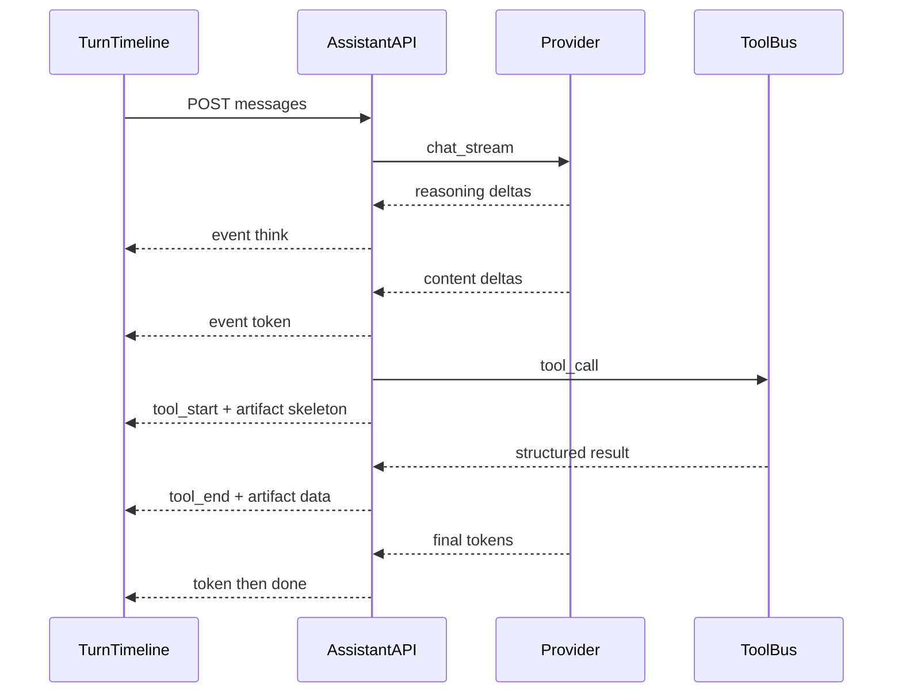

# Loci 助手 · 富渲染与真流式时间线

> **状态**：已落地（grilling 冻结 + 多 Agent 实现 2026-08-05）  
> **词表**：[`frontend/src/features/ai/CONTEXT.md`](../../frontend/src/features/ai/CONTEXT.md)  
> **ADR**：[`ADR-006`](../adr/ADR-006-assistant-rich-render-and-streaming.md)  
> **对齐参考**（只读、不改仓库）：`E:\work_space\qiz-ai-gateway\qiz-ai-gateway-ui` — TurnTimeline / SSE think+token / 工具回执 / data-query 真值表  
> **约束**：不动网关代码；Loci 数字仍只来自工具/引擎；结论正文永远在时间线最底

## 1. 冻结决策一览

| # | 决策 | 选择 |
|---|---|---|
| 1 | 单轮编排 | **TurnTimeline**：Thinking → ToolReceipt → Artifact(s) → **Answer** |
| 2 | Artifact 数据 | **仅工具/引擎真值**；模型不发明 option/数字 |
| 3 | 流式 | **真 SSE** `think` / `token`（后端 `chat_stream`） |
| 4 | 思考来源 | **供应商原生 reasoning**；无则空 |
| 5 | 组件包 | **大包 C**（见 §4） |
| 6 | EP-X | 助手层引入 **vue-element-plus-x**（Thinking / Sender）；业务页仍纯 EP |
| 7 | 持久化 | 富状态进消息 **metadata / 旁表**，`GET session` 带回 |
| 8 | Confirm | 仅 **waiting_user / needs_hitl** |

## 2. 时间线与渐进显现

```text
[ThinkingBlock]     live → 有 token 或工具 running 时自动折叠
[ToolReceipt*]        running shimmer → done/error
[Artifact*]           skeleton(loading) → 真值填入（可多块）
[Answer]              token 流式 Markdown（节流 ~50ms）—— 永远在最底
[Warnings?]
```

- 贴底才跟滚（用户上翻不抢滚动）。
- 流式半成品：未闭合 fence 不抖；HTML 消毒沿用 `assistantMarkdown`。
- **禁止**前端假打字机叠在整段 `done` 上冒充 SSE。



## 3. 流式与事件契约（增量）

在现有 `ai_agent_events` / SSE 上**真正发出**：

| event | data | 说明 |
|---|---|---|
| `think` | `{ delta }` | 原生 reasoning；无则不发 |
| `token` | `{ delta }` | 正文增量 |
| `tool_start` / `tool_end` | 既有 | 另可带 `call_id` |
| `artifact` | `{ kind, title, data, status? }` | `status: loading\|ready\|error` |
| `waiting_user` | 既有 ask | → Confirm 卡 |
| `done` | `{ text, content }` | 终稿兜底（与流式并存） |

后端：`client.chat_stream`（或等价）接入 `AssistantManager`；非流式供应商降级为单次 `done`（仍走时间线，无 token 动画）。

## 4. Artifact 种类（大包 C）

| kind | 渲染 | 数据来源（工具真值） | 默认/规则 |
|---|---|---|---|
| `kline` / 兼容 `qianlong_kline` | `AssistantKlineCard` → 复用 `KlineChart` | `market_kline` bars | 拉取 **≥60**（工具默认可 120）；可视 **≥20**；**MA 5/10/20**（助手卡关掉过重副图或简化） |
| `table` | `AssistantDataTable` → `el-table` | 工具 `columns`+`rows` | 行数 **>50** 或工具 `paginate:true` → 分页；禁止 MD 表当主交互 |
| `echarts` | `AssistantEchartsCard` | 工具 `option` **由引擎/工具组装**，非模型自由创作 | 统计/分布/对比；option 需 schema 校验（禁任意函数） |
| `equity_curve` | 复用 `EquityLineChart` | 回测/复盘工具序列 | |
| `candidate_verdict` | 升级现卡 + 可选表 | 潜龙/候选工具 | |
| `source_strip` | 来源/证据条 | 工具 `sources[]`（代码、日期、hash） | |
| `dual_axis` / 对比图 | ECharts 双轴 | 工具 series | 可并入 `echarts` + `variant` |
| `code` / JSON | 代码块 | 工具预览或结构化 dump | |
| Confirm UI | EP-X / EP 卡 | `waiting_user` | 非独立 kind，属 HITL 层 |

**注册表**：`features/ai/assistantArtifacts.ts` 按 kind 分发；未知 kind → 折叠 JSON，不崩。

### 4.1 K 线细则

- 每日必须有 OHLC（及量若有）；不足 20 根：卡片明示「数据不足」而非截成 5 根糊弄。
- MA：助手场景默认 `[5,10,20]`；计算走 `prepChartOffthread`，不在气泡里重算。
- 高度压缩版布局，避免把行情详情整页塞进对话。

### 4.2 表格细则

- 契约示例：`{ columns: [{prop,label,width?}], rows: object[], paginate?: bool, pageSize?: number }`。
- AI/工具可建议分页；前端硬兜底 `rows.length > 50`。
- 数字列不前端「估算」；空值显式空。

### 4.3 ECharts 细则

- 只接受 JSON-serializable option；白名单系列类型（line/bar/pie/scatter…）。
- loading：`artifact.status=loading` 时 skeleton + 「渲染中」。

## 5. 前端落点

| 落点 | 内容 |
|---|---|
| `features/ai/components/` | `AssistantTurnTimeline`、`AssistantThinkingBlock`（EP-X）、`AssistantArtifactHost`、`AssistantKlineCard`、`AssistantDataTable`、`AssistantEchartsCard`、`AssistantConfirmCard`、`AssistantSourceStrip`… |
| `features/ai/` | `assistantArtifacts.ts` 扩 kind；`assistantRunState.ts` 认 `think`/`token`/loading artifact |
| `shared/components/charts/` | **复用** `KlineChart` / `EquityLineChart`，不 fork |
| `shared/api` + `types` | session 消息带回 `thinking` / `tool_receipts` / `artifacts` |
| 依赖 | `vue-element-plus-x` 仅助手入口注册 |

**Conversation 重排**：废除「正文在 artifact 之上」；统一走 Timeline。

## 6. 持久化

- `ai_messages.metadata_json` 增加约定键：`thinking`、`tool_receipts`、`artifacts`（体积大时截断 preview / 只存 kind+data 引用 id）。
- 或旁表 `ai_message_artifacts(message_id, seq, kind, payload_json)` — 实现期二选一，**推荐旁表**若单消息多图。
- `public_message` 扩展字段；旧客户端忽略未知键。

## 7. 与网关的互借边界

| 借鉴 | 不借鉴 |
|---|---|
| 时间线顺序、折叠节奏、贴底滚动、SSE 节流 | 不改网关仓库、不 npm 链到 gateway-ui |
| 工具真值驱动表/图 | 不搬 widget Shadow DOM |
| EP-X Thinking/Sender 用法 | 不引入网关 BFF/phase 词表 |

后续增强：两边各自演进，原则写进本文与 CONTEXT，避免实现耦死。

## 8. 落地分期（开工后）

1. **Timeline + 结论置底 + ArtifactHost 骨架 + loading**  
2. **chat_stream + think/token 事件**  
3. **KlineCard / DataTable / EchartsCard**（接现有 `market_kline` 等）  
4. **大包其余 kind + Confirm 卡 + EP-X Sender/Thinking**  
5. **持久化 GET session 富字段**  
6. 测试 + README；`bun run build` 供 8787

## 9. 明确不做

- 模型直接吐任意 ECharts option 当权威行情/盈亏  
- 假打字机冒充 SSE  
- 改 qiz-ai-gateway-ui  
- 助手气泡内嵌完整行情详情页（含全部副图默认全开）
