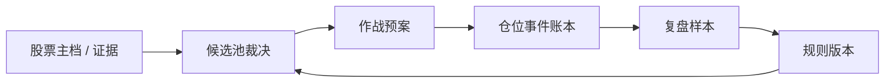

# 潜龙记忆宫殿

`palace.py` 为本项目本地研究账本。它将分析结果串成闭环：股票主档 → 候选裁决 → 作战预案 → 仓位事件 → 结果复盘 → 规则版本迭代。

它只记录事实、研究预案和回看结果；不接券商、不自动下单。

## 宫殿结构



数据默认保存在 `data/palace.db`（Git 忽略）。当前仓位是事件账本的投影。

## Web 工作台页面

| 页面 | 路径 | 作用 |
|---|---|---|
| 总览 | `/` | 账户指标、盈亏曲线、仓位、预案、今日候选 |
| 交割单 | `/journal` | 全部加减持、成本变化、已实现盈亏 |
| 候选池 | `/pool` | 每日全量 vs 精选差异与缘由 |
| 复盘 | `/reviews` | 复盘记忆卡片与收益轨迹 |
| 档案 | `/archive/:code` | 单票事件时间线 |

## 初始化与迁移

```powershell
.\.venv\Scripts\python.exe palace.py init

# 仅对空账本导入潜龙技能现有状态；导入为“起始快照”，不会伪造历史成交。
.\.venv\Scripts\python.exe palace.py import-skill-memory `
  --state C:\Users\86185\.agents\skills\qianlong-position-review\memory\state.json
```

## 每日闭环

```powershell
.\.venv\Scripts\python.exe palace.py candidate 300358 --name 楚天科技 `
  --pool POOL-2026-07-24 --score 81 --decision 重点 --timing D-low `
  --reason "回踩结构位后观察止跌" --evidence "K线与复盘报告路径"

.\.venv\Scripts\python.exe palace.py plan 300358 --title 首仓预案 `
  --scenario "回踩后缩量止跌" --entry-zone "8.10-8.30" --stop 7.76 `
  --target 9.10 --layers 1 --invalidation "跌破结构位且无止跌"

.\.venv\Scripts\python.exe palace.py buy 300358 3200 8.30 --name 楚天科技 --reason "尾盘首仓"
.\.venv\Scripts\python.exe palace.py sell 300358 400 8.60 --reason "按预案减仓"

.\.venv\Scripts\python.exe palace.py review plan PL-XXXX --outcome "T+5 回看" `
  --return-pct 3.2 --mfe 7.1 --mae -2.4 --lesson "回踩确认有效" `
  --next-rule "保留 D-low，样本满 5 条再调整"

.\.venv\Scripts\python.exe palace.py dashboard --output data\palace-dashboard.md
.\.venv\Scripts\python.exe palace.py timeline 300358 --output data\300358-timeline.md
.\.venv\Scripts\python.exe palace.py scorecard
```

## 只读 API（工作台）

- `GET /api/dashboard` — 总览
- `GET /api/trades` — 交割单
- `GET /api/pools` / `GET /api/pools/day` — 候选池汇总与日差异
- `GET /api/reviews` — 复盘记忆
- `GET /api/analytics` — 可视化序列
- `GET /api/timeline/{code}` — 单票时间线

## 可追溯与量化口径

- 仓位：每次买卖保存 `shares_before / shares_after / cost_before / cost_after / realized_pnl`。部分卖出使用潜龙规则重算余票成本。
- 决策：候选带池 ID、评分、时点、理由、证据和 `rule_version`。
- 复盘：可关联候选、预案或交易 ID，并记录收益率、MFE、MAE、教训与下一条规则。
- 精选口径：决策含「重点 / 入选 / 高确定性 / 精选」等视为精选；含「落选 / 排除」等视为未精选。

交易记录、候选裁决和结果复盘均应基于真实行情与已知事实。资金转入/取出不计入已实现盈亏。