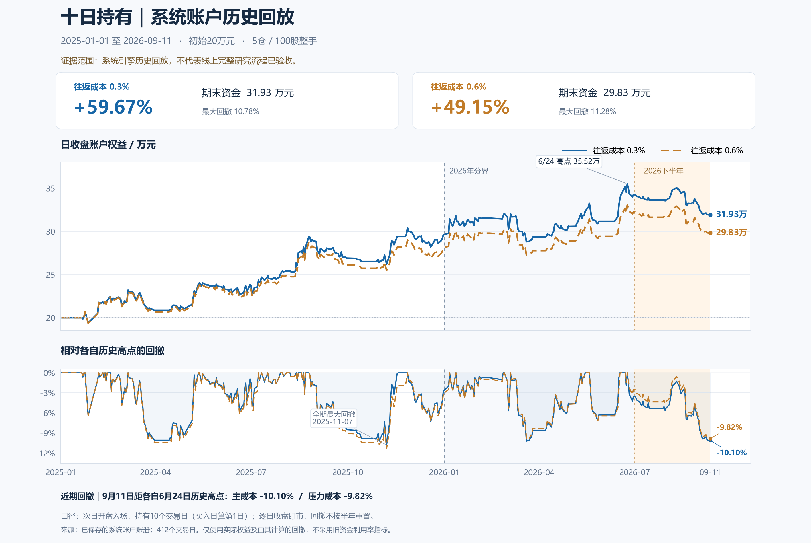

# 回落转强续轮：延长持有、风险控制与事前过滤

目标仍未完成。本轮找到比两日退出更强的研究候选：原创业板真实 14:50 信号，次交易日开盘买入，包含买入日在内第 10 个市场交易日收盘退出。它改善了全期净值和利润分布，但 2026 后段亏损，未通过本轮预先记录的分期要求，尚未作为满意战法替换线上版本。

此前 [研究结果](2026-09-12-impulse-tail-1450-results.md) 中“两日退出最好”只适用于此前比较的方案。本轮新增了更长持有期，不能继续把旧结论外推到所有退出方式。

## 研究设计

数据仍为 2025 年初至 2026-09-11 的真实历史 14:50 信号；2025 用于本轮选择，随后仅核验冻结的胜出者。整个项目已多次观察 2026，所以其结果明确属于探索性验证，不称为新的未见留出。

退出方案预先限定为固定 2/3/5/10/20 日、前两日低点破位后次日开盘退出、2ATR 跟踪退出、入场首日盈利才延长持有。动态判断使用前一已完成交易日信息；不得使用当天最终价格反推开盘决策。固定两日即原研究 A。

采用 20 万元、最多 5 仓、100 股整手、当前名称剔 ST/退、同股不重叠，日收盘估值；卖出当天的回款保守地不供当天新买入使用。主成本每笔往返 0.3%，压力成本 0.6%。涨停开盘不假设能买，跌停或停牌不能卖时延后，期末未平仓继续估值。

2025 选择规则和完整满意门槛记录于 `.local/profit-optimization-20260912/exit_extension_frozen.json`，先写后算。固定10日胜出；固定20日虽然收益接近，但交易数更少、回撤超过26%，未入围。

## 固定10日的结果

| 账户区间 | 0.3%成本净收益 | 日收盘最大回撤 | 0.6%成本净收益 | 主成本闭合交易数 |
|---|---:|---:|---:|---:|
| 2025独立账户 | +48.00% | -10.78% | +40.48% | 59，另5笔未平 |
| 2026上半年独立账户 | +11.53% | -9.65% | +9.11% | 25 |
| 2026年7月至9月11日独立账户 | -6.81% | -8.75% | -7.29% | 9 |
| 全期连续账户 | +59.67% | -10.78% | +49.15% | 96 |

独立分期重置资金和持仓队列，不能相加或相乘还原连续账户。全期压力成本最大回撤为 -11.28%，主/压力账户利润因子为 1.69/1.58，胜率为 61.46%/59.38%。这是全期累计收益，不是年化收益。

主成本实际交易按入场自然周分块重采样 5000 次，单笔平均净收益95%区间为 [-0.063%,+5.585%]，仍覆盖0。去掉收益率最高5笔后，其余平均净收益 +1.188%；金额利润最高5笔占总利润66.88%。相比两日版本，盈利集中有所缓解，但分期与统计证据仍不足以完成目标。

四个实际案例按金额盈利前两笔、亏损前两笔机械选取，保存在 `.local/profit-optimization-20260912/exit_extension_cases.png`。图中展示最终日K，信号另由历史分钟重建；没有用展示中的最终日K替代14:50输入，也没有按案例选参数。

## 附加修改没有通过

固定6%初始止损只测试一档：从入场次交易日开始，缺口按开盘、盘中穿过一分钱按止损价、跌停不能成交时延后。2025压力收益从 +40.48% 降至 +10.15%，仅保留25.08%；回撤由11.28%扩大至16.13%。未通过预设门槛，因此没有继续查看这一方案的2026收益。实际账户61笔平仓无T+0；故意让入场当日可止损的变异被检查拒绝。

六个事前单条件也没有通过2025的筛选：前20日涨幅不超过30%、启动突破此前60日高点、前一市场日宽度至少50%、启动量不超过此前20日均量3倍、14:50价格位于当日区间上三分之一、14:50量达到此前20日均量。没有把胜率或单笔均值较高但资金收益较低的条件强行入选。

另行预声明的“市场宽度至少50%＋固定10日”追加探索同样未通过2025：主成本收益降至 +27.83%，压力收益降至 +24.90%，回撤扩大至13.09%。没有查看此组合的2026收益，也没有把它并入线上规则。

## 公司行为与执行审计

三笔持仓跨公司行为，已对同源真实日线及公司公告核查。26根实际日K与原档OHLCV一致。

- `301033`原定2025-05-28退出，但公司自5月22日停牌、6月6日复牌，延期至复牌日有事实依据。[公司复牌公告](https://static.cninfo.com.cn/finalpage/2025-06-06/1223787878.PDF)
- `301528`在2026-06-25每10股转增4.5股并派现1.08元，新增股当日到账可流通，600股持仓应变为870股。[公司权益分派公告](https://static.cninfo.com.cn/finalpage/2026-06-16/1225373937.PDF)
- 三笔按实际股份和税前现金股息、不将股息再投入计算，与复权因子收益近似的金额差合计 +25.12 元。现金股息统一扣20%的保守研究情景，差额合计 -134.14 元，约为20万元初始资金的 -0.067 个百分点。此处仅是相同实际交易数量下的局部经济核算，不能直接冒充重新递推所有后续仓位的完整账户结果，也不判断用户的实际税率。

进一步检查包括：新账户实现与旧两日基准8组分期/成本的净值和回撤完全一致；T+1、缺口成交、未来价格变异不影响已执行退出、主板10%与创业板20%价格带分支、现金守恒。研究脚本Ruff F通过，未修改生产策略或原始行情档案。

## 复现和后续状态

研究文件均位于 `.local/profit-optimization-20260912/`：

- `exit_extension_study.py`、`exit_extension_summary.csv`、`exit_extension_selected.json`：退出轮及选择记录。
- `exit_extension_audit.py/json`：执行、基准一致性和利润集中检查。
- `exit_risk_report.md`、`exit_risk_stop6.py`：单一止损失败结论。
- `entry_context_*`：六条件研究与宽度追加探索，原选择为空。
- `exit_data_audit_report.md`、`exit_data_audit_economic_returns.json`：实际股份、现金和公告证据。

主板过去的负面结果集中于短持有期，本轮另冻结固定2日/10日比较。2025全部2327个事前预候选票日已取得完整48根分钟K，日线价格全部一致，逐股完整主板公式重算与事前池阈值检查全部一致，没有未知或不一致记录；当前名称过滤后117个信号。

| 主板2025方案 | 主成本收益 | 主成本最大回撤 | 压力成本收益 | 账户入场/平仓/未平 |
|---|---:|---:|---:|---:|
| 固定2日 | -10.06% | -13.73% | -15.64% | 115/115/0 |
| 固定10日 | +17.81% | -14.47% | +12.72% | 79/74/5 |

固定10日的压力成本账户PF为1.37。它有盈利，但主成本回撤超过该轮事先写入的12%门槛，所以 `main1450_2025_result.json` 中 `passes=false`。该单板轮没有继续进入2026。不能把“未通过12%回撤门槛”夸大成“任何主板长持有都无效”。之后另行冻结的组合容量研究通过2025门槛，才补充了2026主板分钟回放，见下节。

采集脚本 `main1450_download.py --extend-history`、重算脚本 `main1450_study.py`，同目录保存 `main1450_frozen.json`、`main1450_2025_quality.csv`、`main1450_2025_signals.csv` 和 `main1450_2025_result.json`。下载进程已正常结束，未留待运行任务。

线上继续沿用原14:50候选筛选；本轮没有以回测收益替代运行验收，没有开启自动交易。最终满意战法的目标仍处于进行中。

## 后续组合、排序和容量检验

此节是下一次目标续轮的真实新增结果，旧门槛及失败记录保持，不将追加假设冒称为从未接触数据的独立检验。

最初冻结主板40%资金2槽、创业板60%资金3槽，两账户独立、不互借资金。2025主成本收益 +44.19%，但回撤13.04%，压力回撤13.90%，未降低风险。主板仅2槽的集中度是问题之一。单独将创业板5槽改为10槽，2025主成本收益 +20.78%、回撤5.45%，压力收益 +18.66%；虽然回撤下降，但压力收益不足原5槽的60%，未通过该轮门槛。

排序轮只比较代码序、此前20日均成交额优先、此前20日波动率较低优先、14:50相对此前20日均量较高优先。后者按2025门槛入围，但在全期主成本下仅 +57.66%、回撤11.64%，相对原代码序 +59.67%/10.78%未改善；压力收益 +50.40%略好。2026H1/H2排序并未改变交易路径，不足以解决近期亏损。未修改线上排序。

随后保持40%/60%资金权重，改为每板5槽、总10槽，作为明确追加的容量假设。2025主成本收益 +37.59%、回撤7.74%，压力收益 +31.26%、回撤8.10%，通过事先写入的2025门槛。冻结后才取得2026主板全部1635个事前候选票日并进行以下比较：

| 40%主板＋60%创业板、每板5槽 | 主成本收益 | 主成本最大回撤 | 压力成本收益 | 平仓/未平 |
|---|---:|---:|---:|---:|
| 2026H1独立账户 | +7.64% | -11.14% | +6.22% | 56/0 |
| 2026年7月至9月11日独立账户 | -4.67% | -6.80% | -5.21% | 20/1 |
| 2025至2026-09-11连续账户 | +47.22% | -10.66% | +37.80% | 215/1 |

全期主/压力资金PF为1.56/1.45，压力最大回撤11.45%。由于2026后段压力收益仍为负，该追加组合没有通过经济门槛，`board_capacity_validation_result.json` 中 `passes_economic_gate=false`。尚未将其注册或部署为正式战法。

再追加一条单一参与规则：只有此前20个市场交易日内已完成的原式虚拟交易不少于3笔、平均毛收益超过压力成本0.6%，才开新仓；所有虚拟信号持续跟踪，实际持仓正常退出。当日收盘及未来退出不得影响当天开盘决策。2025主成本收益只剩 +3.24%、回撤14.21%，压力收益 +1.22%、回撤15.00%，未通过训练，因此没有查看其2026收益，也没有改窗口重试。

## 完整分钟覆盖与缺口归因更新

目前8272个两板事前候选票日已全部有明确归类：主板3962份完整分钟、创业板4309份完整分钟，加1个确认停牌日。主板2026新增1635份均有完整48根5分钟K、日线价格一致、完整公式与事前池阈值重算一致，零个原因未知的行情缺口。

此前未知的 `300685/2026-06-01` 已由公司公告确认自6月1日停牌、6月5日复牌，同源日线在5月29日后直接跳至6月5日。应记为“确认停牌、当日无可成交K”，公式信号保持空值，不能说成取得完整输入后算出的无信号。原缓存未改。[停牌公告](https://static.cninfo.com.cn/finalpage/2026-06-01/1225338024.PDF)、[复牌公告](https://static.cninfo.com.cn/finalpage/2026-06-05/1225351782.PDF)

新的主要证据入口仍在 `.local/profit-optimization-20260912/`：`board_mix_2025_result.json`、`board_capacity_2025_result.json`、`board_capacity_validation_result.json`、`main1450_2026_quality.csv`、`rank_execution_summary.csv`、`capacity_summary.csv`、`recent_expectancy_summary.csv`、`missing_300685_resolution.json`。冻结协议和重跑脚本使用对应前缀。

独立审阅的12项资金/时序夹具通过，覆盖资本隔离、2/3和5/5仓位、同日卖款不得提前使用、期末持仓、NaN排序保留、未来行情变动不影响事前特征、主板10%/创业板20%分支。近期参与规则另通过同日及未来退出收益不得影响当期开仓的变异检查。相关研究脚本Ruff F通过。目标仍未标记完成。

## 基准补充与工程验证候选

本轮随后补齐399006创业板指和000300沪深300的指数日线，使用正确市场的 `get_index_bars` 接口，完整覆盖412个研究交易日及前一日。指数价格点位不等于可交易ETF，也不是含分红的总回报指数。相同往返成本档下，创业板指全期价格代理收益为主成本 +54.99%、压力 +54.53%，日收盘最大回撤25.79%；2026年7月以后主成本亏损23.62%。

这项外部市场证据改变了对“近期亏损”的解释：候选同期 -6.81% 并不等同于独立发生的严重失效。此前“每个分段必须绝对盈利”是助手自设的强筛选条件，不是用户要求；旧轮次 `passed=false` 保留，不回写成通过。最终工程验证应同时检查完整年度、成本、风险和基准，不因单段市场下跌而无限添加事后条件。

为避免用跨年已有仓位带来的盈利掩盖新资金表现，另从2026年初独立20万元回放到9月11日：固定10日34笔闭合交易，主成本收益 +4.21%、最大回撤9.65%；压力收益 +1.22%、回撤9.93%。同期创业板指数价格代理收益 +2.54%/+2.24%，回撤25.79%。压力档并未跑赢指数绝对收益，2026的资金PF仅1.04，应如实保留这个较弱结果。全期候选主/压力收益仍为 +59.67%/+49.15%，最大回撤10.78%/11.28%。

8/10/12日敏感性仅用于检查，不重新选择参数：全期主成本收益 +19.62%/+59.67%/+85.53%，压力收益 +15.40%/+49.15%/+77.72%。十日不是孤立盈利点，但收益对持有期仍敏感，不能声称稳定平台；12日在2026H1转负，三者H2均亏。继续保留先前按2025选择的十日候选，不将12日改为新胜出者。证据在 `holding_sensitivity_report.md` 和24组账户明细。

工程验证候选冻结为：**创业板原式真实14:50筛选，次市场交易日开盘入场，入场日计第1日、第10市场交易日收盘退出，20万元5槽，100股整手，按当前权益分配仓位，不叠加此前被淘汰的固定止损、排序或环境过滤。** 这不是已完成落地的收益承诺；最终目标仍需通过现系统重现和生产验收。

工程实施前定位到以下系统与研究差异，不能仅给目录添加默认值就视为完成：

1. 统一成交引擎 `hold_days` 是从入场日起向后偏移，所需参数是9；默认6%止损必须显式设为 `None`，止盈也为 `None`。
2. 历史runner目前对最终日线调用战法，尚无经过审计的14:50历史输入入口。
3. 当前组合使用每槽固定初始资金，持仓按入场成本计值，非本轮当前权益复投和逐日盯市。
4. 期末持仓、涨停开盘/跌停收盘不能成交、公司行为经济权益也存在口径差异。
5. 普通回测及研究API不会自动继承所有战法默认配置；前端模板也有遗漏。

随后已沿现有 `prepare_backtest_context → execute_backtest_context → analyze_portfolio` 及研究任务/产物链补足这些差异：新增租户私有14:50数据集、原始成交价与经济权益、每日收盘估值账户、期末持仓及完整账户重放；前后端模板继承十日配置，保留旧接口默认行为。系统引擎历史回放的128个信号、96笔实际成交、期末权益319335.3122元与独立研究相符。停牌期间4个交易日的估值较旧研究高2.24691067元，原因是沿用最后一个真实交易日的经济权益，避免无成交占位价格错误套用新复权因子；最终权益与最大回撤不变。

首轮工程镜像 `2.0.0-20260912-053308` 已部署，但不能视为完整研究验收。生产研究任务先因数据集由root导入、服务用户不可读而失败，已改为以loci用户导入；第二次准备来源证据时耗尽768MiB内存。隔离诊断确认旧来源查询合并了614926条回执及4219159条尝试记录，实际报价只关联2875条回执。修复保留全部实际关联回执/尝试，额外历史失败范围使用SQL汇总，严格PIT继续拒绝不完整来源详情。未裁减股票池、行情或日期；没有继续在主服务盲目重试。

截至本段更新，最新来源修复通过241项测试、144个子测试以及两项有效变异检查，602模块导入和14条导入边界检查通过。完整研究/重放的隔离资源验证与最终生产验收仍在进行中。不得以这些局部结果代替线上研究任务成功。

基准与描述性风险比较见 `benchmark_report.md`、`benchmark_strategy_comparison.csv`；其中OLS市场相关性仅为描述，不纠正多次研究选择偏差，不单独作为alpha证明。

## 十日账户曲线

下图从已保存的系统引擎逐日账户权益计算，不使用旧版两日持有结果。两档成本均为20万元、5仓、100股整手；截至2026-09-11距各自2026-06-24历史高点仍分别回撤10.10%和9.82%。这里的近期回撤沿用完整历史高点，不等同于重置资金后独立H2账户的收益。

绘图脚本、SVG和输入SHA记录在 `docs/research/assets/`；图片只证明系统引擎历史回放结果，不替代线上完整研究任务及重放验收。
